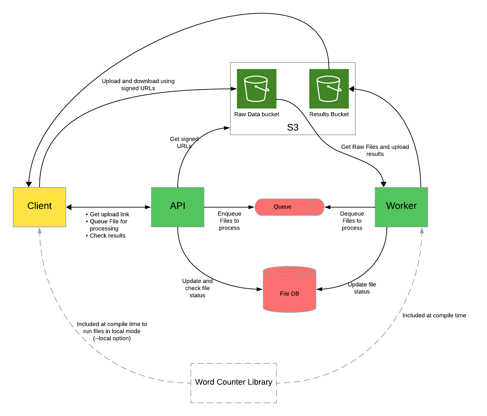

## Introduction
The word-counter lets users count frequency of each word in a given file. 
It provides a highly scalable and potentially fault tolerant system to process files and store results. 
It also provides flexibility to users to choose if they want to submit files to a central server and persist
results in a DB or if they want to do the processing on their local machines and not upload files to a remote server.

## Assumptions
- We need to create a scalable and fault tolerant service that lets users upload large files.
- We need to create a easy to deploy product. 
- We also need to provide users flexibility to do the processing locally in case they dont want their data on the server. 

## How to get the services running
The [word-counter-deployment](https://github.com/vnikhra/word-counter-deployment) repository provides a very easy way to get all the backend services and the api layer running.

You will need to install `Docker` on your system. After that follow these steps:

1. Clone the repo
  ```shell
  git clone git@github.com:vnikhra/word-counter-deployment.git
  ```
2. As we use Minio to mimic S3 services, to get it running properly, you will need to add following to your hosts file(/etc/hosts on mac or linux)
  ```shell
  127.0.0.1 host.docker.internal
  ```
3. Get the services started
  ```shell
  docker-compose up -d
  ```

### This should bring up following containers
- **Word Counter API**: [GitHub Repository](https://github.com/vnikhra/word-counter-api)
    - Provides endpoints for file upload and word frequency analysis.
- **Word Counter Worker**: [GitHub Repository](https://github.com/vnikhra/word-counter-worker)
    - Performs word frequency analysis asynchronously.
- **PostgreSQL**: Database service for storing application data.
- **RabbitMQ**: Message broker used for communication between the API and worker.
- **Minio**: Object storage service to mimic S3 for file uploads.

## How to get the client setup
We provide a node based client to interact with the backend. To set it up follow these steps:
1. Clone the repo:
   ```shell
   git clone git@github.com:vnikhra/word-counter-client.git
   ```
2. Download dependencies
   ```shell
   npm i
   ```
3. Build project
   ```shell
   npm run build
   ```
   
## How to run the client and all available options in it
The client CLI based application that can do these things"
1. Upload your file to the word-counter service and queue it for processing. This can be done using the following command:
  ```shell
  node ./build/index.js <your file path>
  ```
  This will return a file Id that we should store for checking status of the file.

2. Check for results of a file that you submitted earlier. This can be done using the command:
  ```shell
  node ./build/index.js --check-result <fileId>
  ```
  If your file has been processed, this will print the result on the screen, otherwise it will let you know that the processing is not finished.

3. One other option that the client provides you is to run your file locally. This provides you with the flexibility of getting results in an offline fashion but this does not upload results on to the server and thus the results are not persisted. you also have to use your system's resources. This can be done using following command:
  ```shell
  node ./build/index.js --local <your file path>
  ```
  this option will use the same library that the server uses to get the word count. This library can be found at [word-counter](https://github.com/vnikhra/word-counter)

## Where is the code
Following repos make up the product:
- [API](https://github.com/vnikhra/word-counter-api)
- [Worker](https://github.com/vnikhra/word-counter-worker)
- [Client](https://github.com/vnikhra/word-counter-client)
- [Deployment-detail](https://github.com/vnikhra/word-counter-deployment)
- [Library](https://github.com/vnikhra/word-counter)

## Service Architecture
In the following section we will explain how the service works. 

### high level architecture
A simple high level diagram of the architecture is as follows:



### How do the services interact:
A typical file processing job will have the following steps:
1. The user will execute the `client` using `node ./build/index.js <file path>`
2. The `client` will call the `API` service at `GET /api/request-upload-url` to get a fileId and a signed url to upload the file on service's S3 bucket.
3. The `API` service will create an entry for the file in DB and set the status to `requested`
4. The `client` will then call the `API` service at `GET /api/enqueue-file` to let it know that the file is uploaded and it can now start processing the file.
5. The `API` service will then queue a message with the fileId on an AMQ queue and set the file status to `initiated`.
6. The `Worker` is watching the queue for any new messages. it will read the message put by the `API` service and set its status to `processing`
7. The `Worker` will start processing the file.
8. Once the `Worker` has got the result, it will create a file on the other S3 bucket with results and set the file status to `completed`.
9. Meanwhile the user can use the`client` to check the status of file by using the command `node ./build/index.js --check-result <fileId>`
10. The client will call the `API` service at `GET /api/generate-download-url?fileId=<fileId>`.
11. When the `client` calls above API, if the result is not available, the `API` service will return a 403.
12. In case the result is available, the `API` service will return a signed url for the result file.
13. The `client` will then use the signed url to download the file and print it on screen.

### Notes:
1. There are 2 S3 buckets, 1 in which the client uploads files using the signed url provided by API server and the other in which the worker uploads the results.
2. Both API and worker use the same queue.
3. All signed URLs expire in 2 minutes for security reasons.
